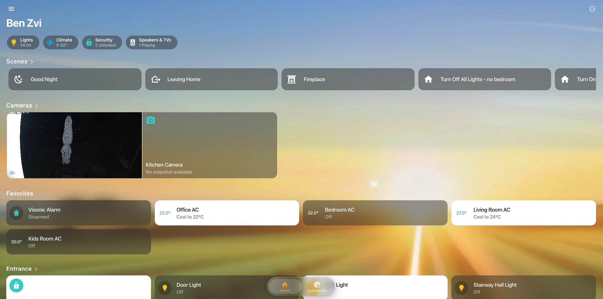
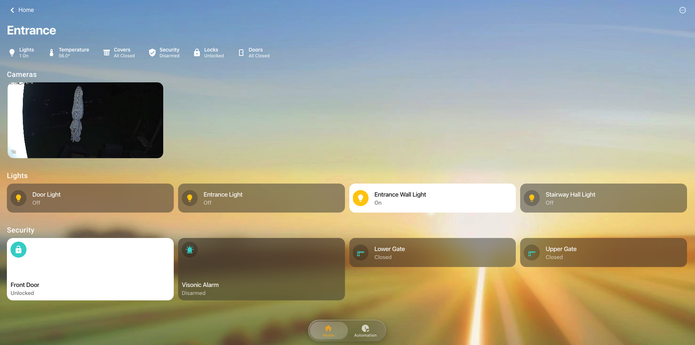
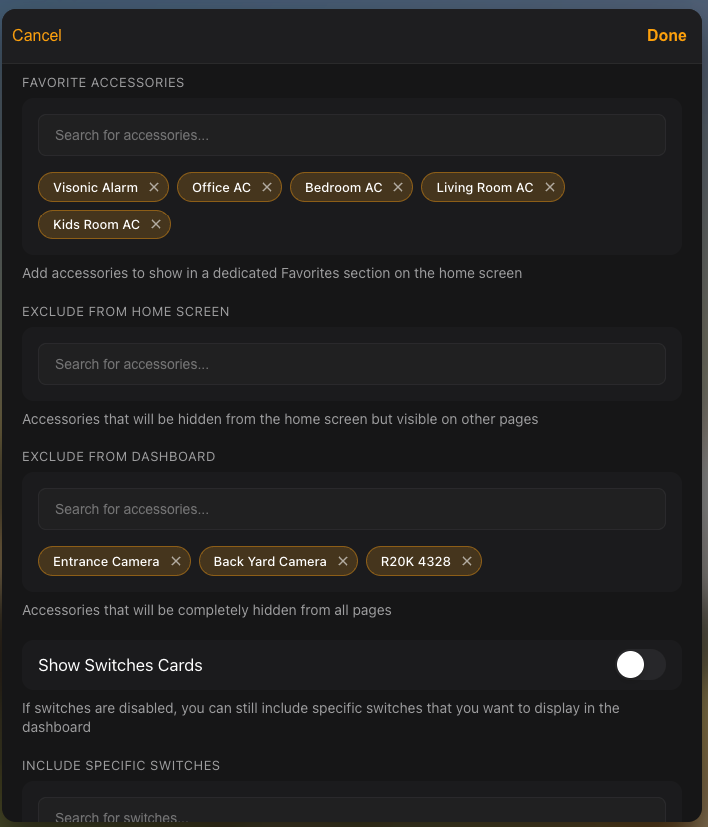
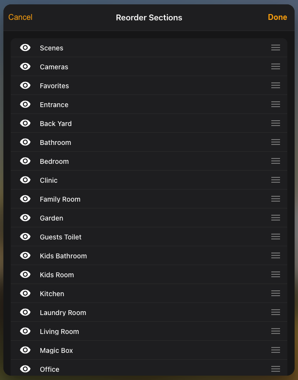
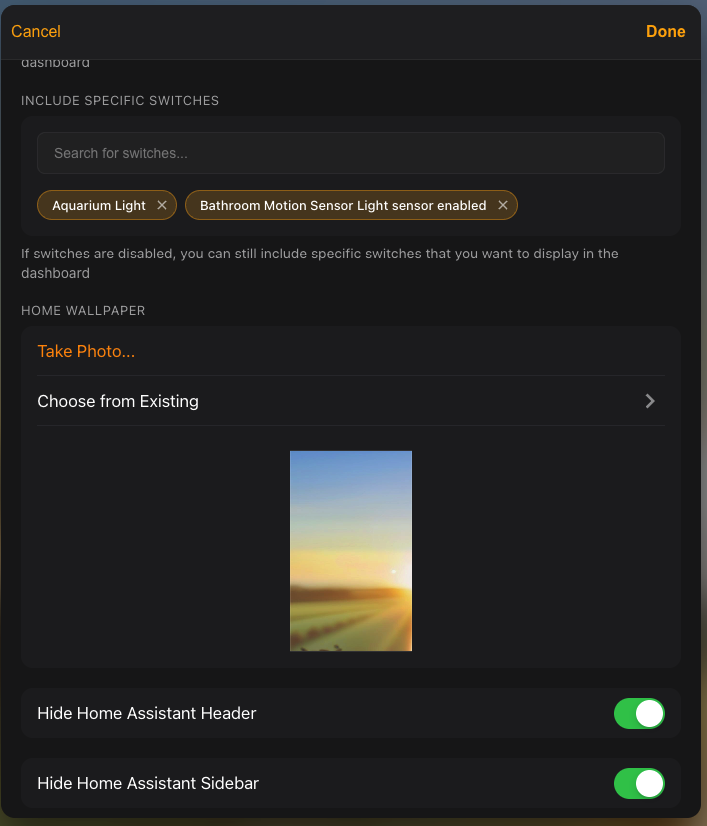
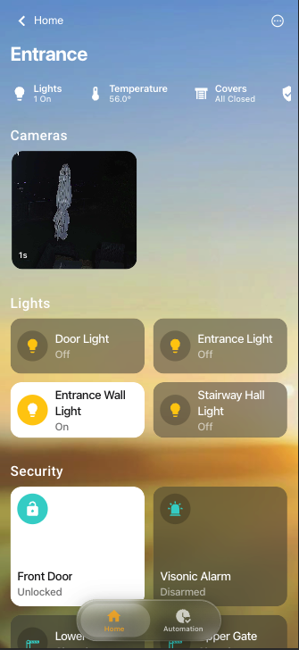

# 🏠 Apple Home Dashboard Strategy

A pixel‑level Apple Home style dashboard for Home Assistant. Instantly turns your Lovelace dashboard into an iOS Home app experience: familiar layout, section structure, color language, typography, card behaviors, navigation and editing flow – all automatic.





> Fully customizable per dashboard: every change you make (favorites, section order, hidden sections, per‑room layouts, tall/regular card toggles, background, included switches, scene & camera order, etc.) is saved inside that specific dashboard’s Lovelace config. Create multiple Apple Home dashboards (e.g. Family vs Wall Tablet vs Kids) – each keeps its own independent appearance & layout without extra YAML.

---
## ✨ What You Get (Apple Home Parity Highlights)
- Automatic My Home view with smart sections (Favorites, Status, Rooms, Groups, Scenes, Cameras)
- True Apple Home grouping: Lights, Climate, Security, Media, Other (+ Default Room for unassigned entities)
- One room page per Home Assistant Area – created automatically, plus a page for entities without an area
- Group pages (Lights / Climate / Security / Media / Other) just like Apple’s category filters
- Dedicated Scenes section/page (scenes + scripts) & Cameras sesction/page
- Favorites section identical in behavior to Apple Home’s “Favorite Accessories” row
- Tall vs Regular card layouts (thermostats, locks, alarms, cameras default tall – others regular)
- Color & icon language mirroring Apple Home (active vs inactive states, functional group colors)
- Context‑aware naming (removes redundant area names from accessory labels)
- Clean navigation with iOS‑style header & back transitions
- Camera tiles show latest snapshot & open live view (simple and Apple‑like)
- Responsive adaptive grid (mobile, tablet, desktop) following Apple spacing feel
- Readable in light or dark (neutral inactive surface, bright active surfaces)
- RTL & multi‑language aware (mirrors layout & chevrons)


---
## 🧠 Automatic Behavior
You add the strategy – everything else is discovered:
- Discovers all entities in your instance, groups them by Area & Domain
- Generates “Room” pages for every Area (and a Default Room for unassigned entities)
- Separates special domains into Scenes & Cameras sections/pages
- Adapts iconography (garage doors vs blinds, outlets vs generic switches, locks, alarm panels, media states)
- Applies Apple‑style active/inactive styling & tall layout defaults

No manual YAML card definitions required.

---
## 🗂 Supported Domains & Interactions
| Domain | Behavior (Icon Tap) | Card Tap | Notes |
|--------|---------------------|----------|-------|
| light | Toggle | More‑info | Standard lighting behavior |
| switch (outlet) | Toggle | More‑info | Outlets auto‑included |
| switch (other) | (If enabled) Toggle | More‑info | Hidden by default; can enable globally or pick specific ones |
| fan | Toggle | More‑info | Styled with climate group color |
| cover | Open/Close | More‑info | Garage / gate icons auto detected |
| lock | Lock/Unlock | More‑info | Tall by default |
| alarm_control_panel | (Arm/Disarm via more‑info) | More‑info | Tall by default |
| climate | More‑info | More‑info | Shows current temperature / mode (tall by default) |
| media_player | Play / Pause / Power | More‑info | Active style when playing |
| scene | Activate | Activate | Action pill style |
| script | Run | Run | Same as scenes |
| camera | Open live view | Open live view | Tall snapshot tile |
| binary_sensor / sensor | Status only | More‑info | Used in Status/Security summaries |

**Switch handling:** Regular switches are excluded by default (to avoid clutter from technical / helper switches). Outlets (device_class=outlet) are always shown. You can enable all switches or selectively add specific ones via customization.

---
## 🏡 Views Generated



| View Type | Purpose |
|-----------|---------|
| Home (My Home) | Core overview with sections & quick navigation |
| Group Pages | Lighting, Climate, Security, Media, Other (filtered accessories) |
| Room Pages | One per Area (room‑centric collections) |
| Default Room | Accessories with no assigned Area |
| Scenes | All scenes & scripts (trigger actions) |
| Cameras | All cameras (snapshot tiles) |

---
## ⭐ Favorites
Just like Apple Home:
- Mark any accessory as a Favorite (appears at top of Home view)
- Reorder Favorites in Edit Mode (drag & drop)
- Favorites always use regular (not tall) layout for a compact grid

---
## 🧩 Sections (Home View)
| Section | Content | Notes |
|---------|---------|-------|
| Favorites | Manually chosen favorites | Hidden if empty |
| Status (Chips / Summary) | At‑a‑glance counts (e.g., lights on, locks, climate, motion) | Dynamic text & counts |
| Rooms | First accessories for each room (tap room name to open page) | Auto omits empty rooms |
| Groups | Inline shortcuts to group pages | Mirrors Apple’s filter chips concept |
| Scenes | All scenes & scripts | Also has dedicated page |
| Cameras | Camera snapshots | Opens Cameras page or live view |

You can hide or reorder sections in Edit Mode.

---
## ✏️ Edit Mode & Customization





Long‑press the header Edit toggle (or press “Edit”) to enter Edit Mode. You can:
- Drag & drop accessories within a Room, Favorites, Scenes, Cameras, or Domain group
- Reorder sections on the Home view
- Hide sections you don’t want to see
- Mark / unmark favorites
- Toggle tall vs regular size (supported entities only: climate, lock, alarm, camera) per context
- Reorder Scenes and Cameras individually
- Per‑room reordering (each Room page keeps its own layout)
- Per‑domain ordering inside Room pages (Lighting, Climate, Security, Media sub‑groups)

All changes are stored with the dashboard and persist automatically.

---
## 🎨 Visual Language
- Active accessories: white surface, dark text, colored circular icon background (group color) – Apple style
- Inactive: translucent dark tile, colored icon, subdued text
- Thermostats: large temperature typography (tall layout) or compact inline (regular)
- Scenes / Scripts: action style (no state line, clean icon)
- Locks, alarm panels, cameras: tall for glanceable status & clarity
- Group colors:
  - Lights / Other (Outlets): Warm Yellow
  - Climate / Fans / Covers: Cool Blue / Mode color accent
  - Security (Locks, Alarm, Cameras, Sensors): Teal
  - Media: Neutral White icon on dark / inverted when active

## 🌅 Backgrounds & Appearance
Personalize the dashboard backdrop while keeping accessories readable. Choose or change background styles (solid, translucent, image-based or preset themes) directly from the Home settings – updates apply instantly across all views.



Notes:
- Background persists (per dashboard) after reloads
- Designed to maintain Apple-style contrast & legibility
- Works with light/dark system themes

---
## 🌐 Rooms & Naming Cleanup
Accessory names are automatically cleaned to remove redundant room/area names (mirrors Apple’s shorter labels). Example: “Living Room Lamp” in the Living Room page becomes just “Lamp”.

---
## 🔐 Security & Accessory Types
- Garage doors / gates get dedicated icons & grouping under Security
- Outlets distinguished from other switches
- Alarm panels & locks elevated with tall styling
- Motion / contact / occupancy sensors feed status summaries

---
## 📸 Cameras (User View)
- Snapshot tile (tall) – opens live stream on tap
- Graceful fallback icon when camera unavailable
- Shown in Home section and full Cameras page

(Underlying snapshot mechanics intentionally omitted – you just get a native feel.)

---
## 🛠 Installation
### Option 1: HACS (Recommended)
1. Add this repository as a Custom Repository (Category: Dashboard)
2. Install “Apple Home Dashboard Strategy”
3. Restart Home Assistant if prompted
4. Add resource automatically (or manually if needed):
   - URL: /hacsfiles/apple-home-dashboard/apple-home-strategy.js
   - Type: Module

### Option 2: Manual
1. Download `apple-home-strategy.js` from the latest release
2. Place in `/config/www/apple-home-strategy.js`
3. Add a Lovelace resource:
   - Settings → Dashboards → Resources → +
   - URL: /local/apple-home-strategy.js
   - Type: Module

### Create the Dashboard
Create a new dashboard (e.g. path: `apple-home`) and set strategy:
```yaml
strategy:
  type: custom:apple-home-strategy
  options:
    title: My Home  # Optional custom header title
views: []
```
Open the new dashboard – it will populate automatically.

---
## ⚙️ Optional Strategy Options
| Option | Default | Description |
|--------|---------|-------------|
| title  | Home Assistant location_name | Custom label for the Home (My Home) view header |

Example:
```yaml
strategy:
  type: custom:apple-home-strategy
  options:
    title: Casa
```

---
## 🧪 Customization Reference (Settings Stored Automatically)
| Feature | Where | Persisted | Notes |
|---------|-------|-----------|-------|
| Favorites | Home view | Yes | Drag reorders, remove to unfavorite |
| Section Order | Home view | Yes | Drag entire section handles (in Edit) |
| Hide Section | Home view | Yes | Toggle visibility in Edit |
| Entity Order (Room) | Room page | Yes | Per room |
| Domain Order (Room) | Room page sub‑groups | Yes | Lights / Climate / Security / Media each track order |
| Tall Card Toggle | Entity (Edit Mode) | Yes | Per context; favorites always regular |
| Scenes Order | Scenes page & section | Yes | Unified order |
| Cameras Order | Cameras page & section | Yes | Unified order |
| Switch / Outlet Inclusion | Global logic | Auto | Outlets always shown; other switches configurable (global setting planned) |
| Background Style | Home view | Yes | (Background presets support – configurable) |
| Hide Header / Sidebar | UI preference | Yes | Optional minimal mode |

No YAML needed for any of the above.

---
## 🔄 Updating
1. Update via HACS (or replace the single JS file manually)
2. Refresh the dashboard (customizations persist)

---
## 🧭 Tips

- Use Areas in Home Assistant – they drive Room generation & cleaner names
- Name scenes & scripts with friendly labels (appear exactly as given)
- Favor short entity names; area name removal keeps things tidy
- Use Edit Mode after first load to fine‑tune top‑level order & favorites

## 📱 Mobile Experience
Optimized for narrow viewports: adaptive grid, comfortable touch targets, and condensed header.



---
## ❓ FAQ (Condensed)
| Question | Answer |
|----------|--------|
| Why is a room empty? | The Area has no supported entities or they’re all hidden/disabled. |
| Where are my sensors? | Security/status‑relevant sensors feed summary/status; pure sensors may appear under Security/Other. |
| Can I manually write card YAML? | Not needed; the strategy generates all layout. |
| How do I reset layout? | Remove / rename the dashboard, recreate – or clear saved customizations (future UI reset button). |
| Can I localize labels? | Uses HA language automatically (RTL supported). |

---
## 📄 License
MIT – see `LICENSE`.

---
## 🙌 Support & Reality Check
This project represents weeks of focused effort refining countless tiny Apple Home interface details. A large portion of the implementation was accelerated with AI-assisted ("vibe") coding, then manually reviewed and polished. That means:
- You get a lot of functionality fast
- Edge cases may still surface
- Feedback & issue reports are very welcome

If you find this useful and want to support continued refinement:
- Patreon: https://patreon.com/nitaybz
- Ko-fi: https://ko-fi.com/nitaybz
- PayPal: https://paypal.me/nitaybz

Stars, shares, and kind words help too. Thank you.

---
Made with ❤️ to bring Apple’s Home experience into Home Assistant.
